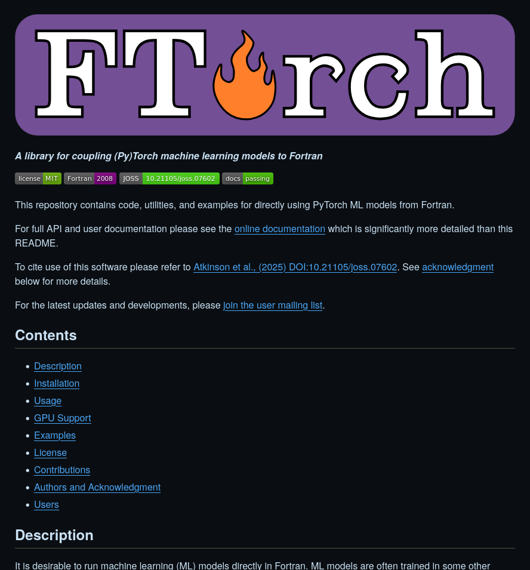

# Documentation

## Documentation

- Not all information can be conveyed in code
- We need to tell other people how to use our projects
- And sometimes ourselves!
- Documentation covers anything outside of the code/metadata

## README

:::{.columns}

::::{.column width=50%}

&nbsp;

- Markdown file at the project root
- Should contain:
  - Description of project
  - Dependencies
  - Instructions on building/running
::::

::::{.column width=50%}

::::
:::

## Comments

- Comments in code are also another form of documentation
- Comments should:
  - Explain *why* the code is doing something
  - Give context that is external to the scope

## Generating Docs

- Use tools that generate docs from source code
- Single source of truth
- Comments/Docstrings embedded in code
- Reduce separation between code and docs

## Licences

- Licences are necessary for reproducibility!
- They define how code can be used/reused
- Enforce openness of code and data
  - FOSS licenses eg. GPL, MIT, BSD, etc
- Many explanations of which licence to use exist (and I'm not a lawyer!)
- [choosealicense.com](https://choosealicense.com/)
