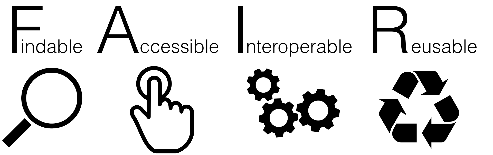

# FAIR and FAIR4RS Principles

---

The FAIR principles were first introduced for data, and later adapted for research software (FAIR4RS) [^1].

&nbsp;

FAIR stands for

{width=80%}

[^1]: <https://www.nature.com/articles/s41597-022-01710-x>

---

## Findable 

Software, and its metadata, are easy for humans and machines to find.

 - Cite your software and data in your papers (DOIs).
 - Document which results you got with which software and data version.
 - Use version control.
 - Document your data and software.

---

## Accessible 

Software, and its metadata, are retrievable via standardised protocols.

  - Version controlled, documented and identifiable.
  - Ideally, software and data are open source.
  - Use a permissive license.

---

## Interoperable 

Software interoperates with other software by exchanging data and/or metadata, 
and/or through interaction via a application programming interfaces (APIs), described through standards.

 - Provide clear and well documented interfaces.
 - Avoid reinventing the wheel - use standards. (There have been clever people before you...)

---

## Reusable 

Software is both usable (can be executed) and reusable (can be understood, modified, built upon, or incorporated into other software).

 - Again: Documentation, licenses, standards.
 - Build your software in a modular way.

