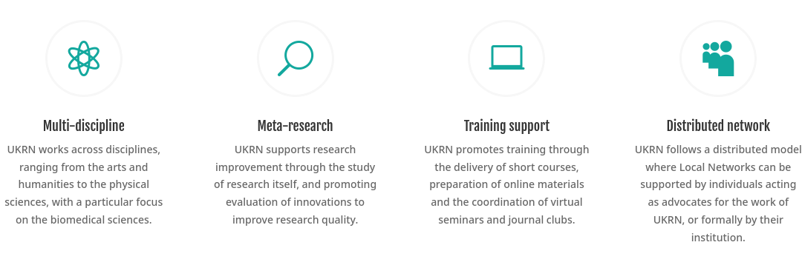
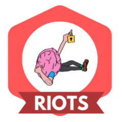
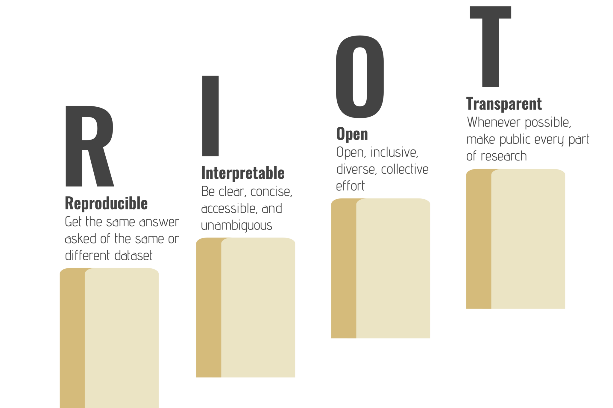
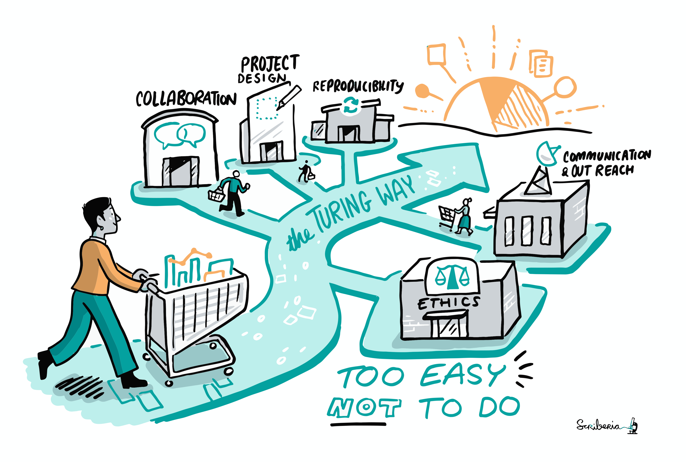
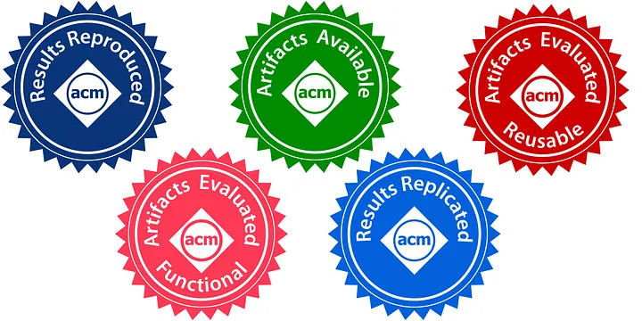
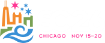
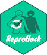

# Reproducibility Initiatives 

---

## Efforts to improve software/research reproducibility {.smaller}

- Various groups and organisations work for better reproducibility.

- Conferences and journals start to ask for software, data etc. to back up
research findings.

- Software sustainability and research software engineering have become a
thing (internationally).

- But still not widely known outside of the bubble!

---

## {width=1.5cm}  UK Reproducibility Network {.smaller}

- Peer-led consortium within the UK, international networks

- National Steering Group, local and institutional groups

- Training, events, engaging with stakeholders

- <https://www.ukrn.org/international-networks/>

{width=80%, fig-align="center"}

---

## {width=1.5cm} RIOT Science {.smaller}

- Groups at universities (mostly Psychology, mostly UK)

- Conferences, events, seminars open to everyone

{width=60%, fig-align="center"}

---

## The Turing Way {.smaller}

- Handbook

- Community

- Collaboration

&nbsp;

{width=80%, fig-align="center"} 

---

## {width=10%}  ACM Reproducibility Badges {.smaller}

&nbsp;

{width=90%, fig-align="center"} 

---

## {width=10%} SC Reproducibility Initiative {.smaller}

- SC (formerly Supercomputing), The International Conference for High
Performance Computing Networking, Storage, and Analysis

- Initiative started in 2015, Artifact Descriptions (ADs) optional for the
first years -> used in Student Cluster Competition

- Then gradually made mandatory for more categories/prizes
 Computational Results Analysis (CRA) -> Artifact Evaluation (AE) appendix still optional

- AD/AE committee evaluates appendices and recommends ACM badge awards (IEEE badges seem to have vanished)

- Reproducibility challenge introduced 2021

--- 

## {width=5%}  ReproHack {.smaller}

- Challenge: Reproduce the results of a paper in one day!

- Started in 2016 and 2017 as satellite events of OpenCon (inspired by a
course by Owen Petchey)

- Developed further by Anna Krystalli in her SSI fellowship

- More events, a team formed, remote ReproHacks became a thing....

- ReproHack Hub launched in 2021
	- Material and checklists for organisers
	- Paper database
	- Evaluation forms
	- Events listing
	- Support through ReproHack Slack
	
---

## And more! {.smaller}

- JOSS

- ReScience C

- CODECHECK

- ML Reproducibility Challenge

- Climate Informatics Reproducibility Challenge

- ...

