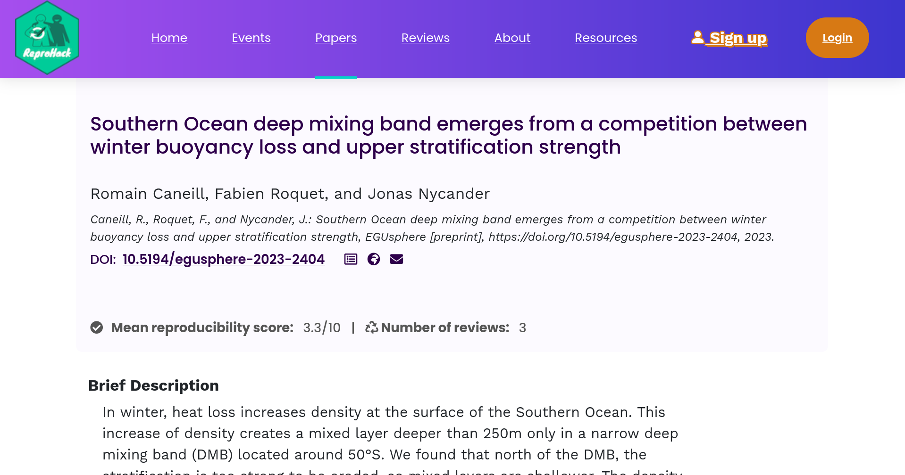

# Reproducibility Initiatives 

---

## Efforts to improve software/research reproducibility

- Various groups and organisations work for better reproducibility.

- Conferences and journals start to ask for software, data etc. to back up
research findings.

- Software sustainability and research software engineering have become a
thing (internationally).

- But still not widely known outside of the bubble!

---

## {style="width:1.5cm; vertical-align:bottom;"}  UK Reproducibility Network

- Peer-led consortium within the UK, international networks

- National Steering Group, local and institutional groups

- Training, events, engaging with stakeholders

- <https://www.ukrn.org/international-networks/>

{width=80%, fig-align="center"}

---

## {style="width: 5%"} RIOT Science

:::: {.columns}

::: {.column width="50%"}
- **R**eproducible **I**nterpretable **O**pen **T**ransparent
- Groups at universities (mostly Psychology, mostly UK)
- Conferences, events, seminars open to everyone

:::

::: {.column style="width: 50%; fig-align: center; "}
{style="width: 80%; background-color: white;"}
:::

::::

---

## The Turing Way

:::{.columns}
:::{.column width=30%}

\

- Handbook
- Community
- Collaboration
:::
:::{.column width=70%}
{width=80%, fig-align="center"} 
:::
:::
---

## {style="width:20%; vertical-align:text-bottom;"} ACM Reproducibility Badges

&nbsp;

:::: {.columns}

::: {.column width="50%"}
- Applied to research artifacts e.g. papers
- Used across ACM journals and conferences
- Rewards researchers for reproducibility efforts
:::

::: {.column width="50%"}
{style="width:90%; fig-align:center"}
:::

::::

---

## {width=10%} SC Reproducibility Initiative

&nbsp;

- SC (formerly Supercomputing), The International Conference for High
Performance Computing Networking, Storage, and Analysis

- Initiative started in 2015
  - Artifact Descriptions (ADs) optional for the first few years 
  - used in Student Cluster Competition

- Then gradually made mandatory for more categories/prizes
  - Computational Results Analysis (CRA) 
  - Artifact Evaluation (AE) appendix still optional

- AD/AE committee evaluates appendices and recommends ACM badge awards

- Reproducibility challenge introduced 2021

--- 

## {width=5%}  ReproHack

- __Challenge__: Reproduce the results of a paper in one day!

- Started in 2016 and 2017 as satellite events of OpenCon (inspired by a
course by Owen Petchey)

- Developed further by Anna Krystalli in her SSI fellowship

- More events, a team formed, remote ReproHacks became a thing....

- ReproHack Hub launched in 2021

### ReproHack Hub

- Material and checklists for organisers
- Paper database
- Evaluation forms
- Events listing
- Support through ReproHack Slack

---

## And more!

- JOSS

- ReScience C

- CODECHECK

- ML Reproducibility Challenge

- Climate Informatics Reproducibility Challenge

- ...
