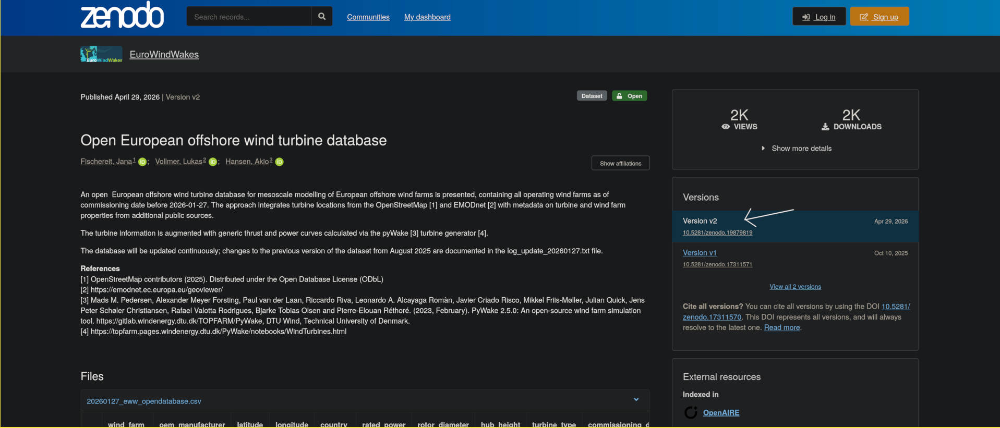
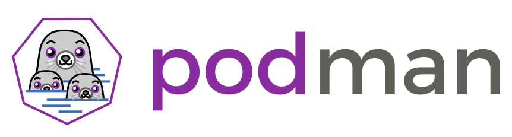

# Dependencies

## Dependencies

- All software has dependencies
- Some are more obvious than others:
  - Data/input
  - Packages/libraries e.g. `numpy`, `Eigen`
  - System libraries
  - Compiler/Interpreter
- If your code can't run without it, it's a dependency!

## How to discover dependencies

- Some dependencies may be "implicit"
- For example, you may have a library installed on your system
- Since the code "just works", you may not be aware of the dependency
- To find these, try running on a different system (or multiple) and see what breaks

## How to declare dependencies

- List them in a tracked file in the repository
  - e.g. add a "Dependencies" section to your README.md
- Specify:
  - Versions of each dependency e.g. `numpy` 2.3.9
  - Where/how to aquire the dependency

## How to declare data dependencies

:::{.columns}
:::{.column width="30%"}
- Links to publicly accessible data dependencies
  - Zenodo or some other long term solution
- Reference specific versions of the data
- Ideally automate the fetching of the data
:::
:::{.column width="70%"}

:::
:::

## Dependency metadata

- There are automated ways of resolving dependencies
- Usually language/tool specific
- Some tools automatically update dependency metadata
  - e.g. Rust's `cargo`, Julia's `Pkg`, `uv` for Python
  - Project file: Depencies and compatible versions
  - Lock file: Write exact version (plus other metadata e.g. source) of *every* 
    dependency you are using
  - Important to track both - lock files record the exact environment you use

## System dependencies - Conda

- Python centric package manager
- Can be used for installing python packages
- Also able to manage environments
  - useful for per-project dependencies
  - can install system dependencies
  - even different python versions!
- Available on most HPC systems (usually as Miniconda)
- Can export environments to text-based files

## System dependencies - Containers

:::{.columns}
:::{.column width="60%"}
- Containers package up code and all dependencies
- Virtualised operating system
- Faster than a virtual machine with many of the benefits
- Examples:
  - Docker (Closed source but popular)
  - Podman (Open source alternative)
  - Apptainer (HPC focused/compatible)
- Portable and cross-platform
:::
:::{.column width="40%"}

:::
:::

## System dependencies - Nix/Guix

:::{.columns}
:::{.column width="60%"}
What they have in common:

- Declarative package managers
- Use pure functional languages to create environments
  - same inputs = same outputs
- Packages are hashed
  - can lookup if package already exists locally
- Publicly hosted and *versioned* package repository
  - All packages have defined and unchanging dependencies
- Handles all dependencies automatically
  - even linked libraries, so no hidden dependencies!
:::
:::{.column width="40%"}
How they differ:

- Nix language vs Guile scheme
- Guix package repository only hosts fully open source packages
  - Can be difficult when using vendor-locked software e.g. CUDA
:::
:::
